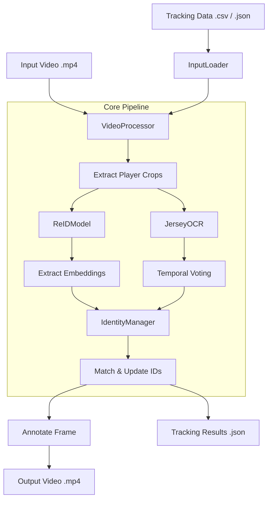

# AFL Player Re-Identification & Jersey OCR Documentation

This project provides a robust pipeline for tracking and re-identifying AFL players across video frames. It enhances standard YOLO-based tracking by using Deep Re-Identification (ReID) embeddings and temporal Jersey Number OCR to maintain consistent identities even when players exit and re-enter the frame.

## System Architecture

The following diagram illustrates the data flow from raw video and detections to the final annotated output.

---

## 📂 Project Structure

- `ReID-Pipeline.ipynb`: The main entry point containing the full workflow and visualization tools.
- `ReID/`: Contains the core re-identification logic.
    - `ReIDModel.py`: Wrapper for OSNet to generate appearance embeddings.
    - `IdentityManager.py`: Logic for matching detections to known tracks using ReID and OCR.
    - `InputLoader.py`: Utility to parse tracking data from external sources.
- `JerseyOCR/`: Contains jersey detection and recognition logic.
    - `JerseyOCR.py`: Uses EasyOCR and image preprocessing to recognize numbers.
    - `Jersey_OCR.ipynb`: Experimental notebook for OCR testing.
- `GoldCoast_Carlton_VFL_tracking_parsed.csv`: Baseline detection data used as input.

---

## Modules Description

### 1. `ReIDModel`
**Purpose**: Transforms visual appearance into a mathematical vector (embedding).
- **Model**: Uses `osnet_x1_0` (Omni-Scale Network).
- **Process**: Resizes crops to 256x128, normalizes pixels, and runs inference on GPU/CPU to produce a 512-dimension feature vector.
- **Efficiency**: Supports batch processing for high-performance inference.

### 2. `JerseyOCR`
**Purpose**: Identifies player jersey numbers to provide a "hard" identity check.
- **Mechanism**: Extracts the torso region (20%-60% height), applies adaptive thresholding/blurring, and runs **EasyOCR**.
- **Temporal Voting**: To handle noise and blur, it maintains a buffer of recent successful OCR reads per track and uses a majority vote (Counter) to decide the final number.

### 3. `IdentityManager`
**Purpose**: The "brain" of the tracking system that resolves who is who.
- **Multi-Modal Matching**:
    1. **Hard Match**: If a jersey number is detected and matches a known track, it assigns that ID.
    2. **Soft Match**: If no jersey match is found, it calculates the **Cosine Similarity** between current ReID embeddings and stored gallery embeddings.
- **Memory**: Stores the last 30 embeddings per player to handle appearance changes over time.

### 4. `InputLoader`
**Purpose**: Decouples the tracking logic from the source format.
- Supports both **CSV** (standard YOLO/StrongSORT exports) and **JSON**.
- Maps raw coordinates `[x1, y1, x2, y2]` into a frame-indexed dictionary.

### 5. `VideoProcessor`
**Purpose**: Orchestrates the entire lifecycle.
- Reads video frame-by-frame.
- Manages the `crop -> embedding -> OCR -> match` sequence.
- Writes the final annotated video with persistent IDs and Jersey labels.

---

## Workflow breakdown

1.  **Initialization**: 
    - The `InputLoader` reads a CSV file containing detections (frame, x1, y1, x2, y2).
    - Models (`ReIDModel`, `JerseyOCR`) are loaded into GPU memory.
2.  **Detection processing**: 
    - For every frame, the `VideoProcessor` cuts out "crops" of every detected player.
3.  **Identity Matching**:
    - Each crop is passed to the `ReIDModel`.
    - The `IdentityManager` compares the crop's signature against its memory.
    - If a match is > 70% (default threshold), the player keeps their ID. Otherwise, a new ID is assigned.
4.  **OCR Verification**:
    - While tracking, `JerseyOCR` continuously looks for numbers.
    - Once a number is confirmed (e.g., player "ID 5" is seen with "#23" multiple times), that number is permanently associated with that track.
5.  **Output**:
    - An annotated video is generated (`output.mp4`).
    - A JSON file (`output.json`) is saved, containing the full history of every player's position and identity.

---

## Summary of Results
Compared to standard YOLO tracking, this pipeline reduces "ID switches" by:
- Using appearance features instead of just spatial overlap (IoU).
- Recovering identities after a player leaves and re-enters the camera view.
- Leveraging jersey numbers as a ground-truth anchor.
