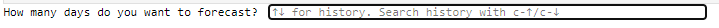
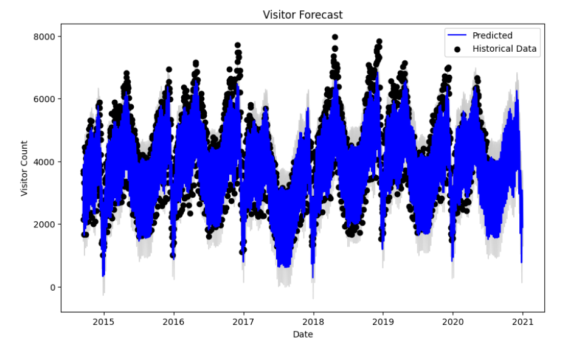
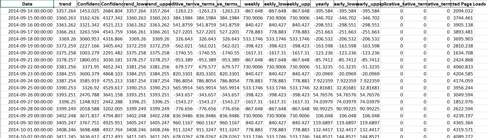

# Forecasting Model Documentation

## Overview
This document provides a detailed overview of the forecasting model developed for predicting the number of visitors to a place. The model uses the **Prophet algorithm** and incorporates features such as the **day of the week** and **user-specified forecasting periods**. The following sections cover installation, usage, and output details, including placeholders for screenshots.
---
## 1. Installation

### 1.1 Requirements
To run the forecasting model, ensure the following packages are installed:
- pandas
- prophet
- matplotlib
- openpyxl (for saving output to Excel)

### 1.2 Install the Required Packages
Before running the visitor forecasting model, ensure you have the following Python packages installed in your environment. These libraries are essential for data handling, forecasting, plotting graphs, and saving results.

#### Step-by-Step Installation:
You can install these packages using `pip` by running the following commands in your terminal or command prompt:

1. Install pandas:
   ```bash
   pip install pandas
   ``` 
   
2. Install Prophet (this will also install cmdstanpy, which Prophet depends on):
   ```bash
   pip install prophet
   ```

3. Install matplotlib:
   ```bash
   pip install matplotlib
   ```

4. Install openpyxl (for exporting results to Excel):
   ```bash
   pip install openpyxl
   ```

Alternatively, you can install all the required packages at once by running:
   ```bash
    pip install pandas prophet matplotlib openpyxl
   ```

#### Verifying the Installation: 
Once the packages are installed, you can verify them by importing them in Python. Open a Python environment (either a Jupyter Notebook or Python shell) and run:

```
import pandas as pd
from prophet import Prophet
import matplotlib.pyplot as plt
import openpyxl
```
If there are no errors, the packages are installed correctly, and you are ready to run the forecasting model.

---
## 2. How to Use the Forecasting Model

### 2.1 Load the Data
- Prepare a CSV file containing historical visitor data, with columns for date and visitor count.
- For demonstration, website visitor data was used to build the model.

### 2.2 Execute the Script
- Run the provided script to start the forecasting process.
- You will be prompted to input the number of days to forecast.

---

## 3. User Interaction

### 3.1 Input Prompt for Number of Days
- Once the script is executed, it will prompt you to input a number representing how many days into the future you want to predict.
- Enter a valid numerical value.
```
How many days do you want to forecast? [Input Box]
```


---

## 4. Output Details

### 4.1 Forecast Graph
- After execution, the model will display a forecast graph:
  - **X-axis**: Date
  - **Y-axis**: Predicted number of visitors
- The graph will include both historical data and the forecast for easy comparison.



---

## 5. Saving the Results

### 5.1 Exporting to Excel
- The forecasted visitor data (with lower and upper confidence intervals) is automatically saved in an Excel file named `visitor_forecast_output.xlsx`.
- This file can be used for further analysis or sharing.



---

## 6. Technical Details

### 6.1 Data Preprocessing
- The historical visitor data is processed by:
  - Converting the **Date** column into a `datetime` object.
  - Cleaning the **Visitor.Count** column by removing any non-numerical characters to ensure accurate numerical operations.

### 6.2 Model Features
- **Days of the Week**: The model accounts for variations in visitor patterns on weekdays vs. weekends.
- **Holidays (Optional)**: For greater accuracy, the model can optionally incorporate holiday data, which is particularly useful during special events or holiday seasons.

---

