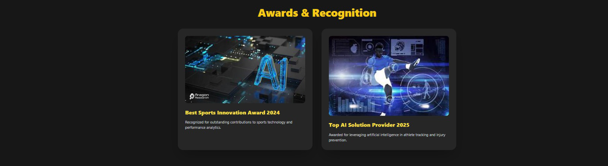
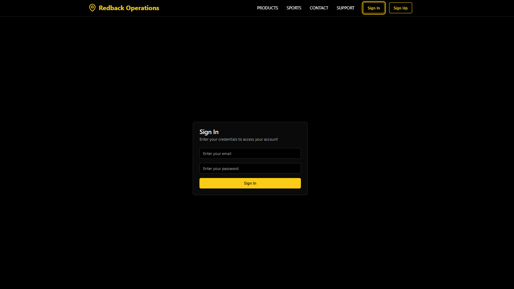
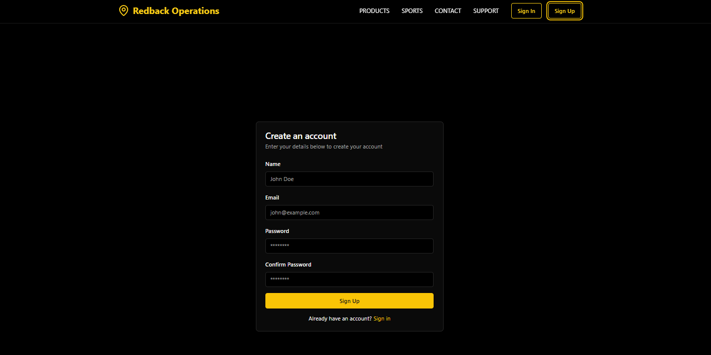

# Project Orion – AI Sports Performance Assistant 🚀

Welcome to **Project Orion**, an innovative AI-powered sports performance platform designed to elevate athletic performance, deliver data-driven insights, and empower sports teams to achieve new heights of excellence.

Built using cutting-edge web technologies and machine learning, **Project Orion** provides athletes, coaches, and sports scientists with actionable insights, advanced analytics, and intuitive tools for tracking and improving performance.

## Key Features

| Feature                      | Description                                                                                     |
|-----------------------------|-------------------------------------------------------------------------------------------------|
| Real-Time Performance Insights | Analyze video and motion data in real time to deliver precise, personalized training recommendations. |
| Interactive Dashboard       | Real-time, interactive dashboard for tracking performance metrics and visualizing actionable insights. |
| AI Chatbot Assistant        | AI chatbot helps users navigate the platform and answer training-related/ other questions. |
| Blog Section                | Blog articles on sports science, injury recovery, nutrition, and AI in training.        |
| Testimonials & Awards       | Displays user testimonials and highlights recognitions received for innovation in sports tech.  |
| FAQ Accordion               | Clean accordion-style FAQ section for intuitive access to common questions.                     |
| Star Rating & Feedback      | Collects user feedback and ratings to help improve the platform.                                |
| SignIn/SignUp      | Firebase Authentication for secure sign-in with email/password.              |
 
##  Screenshots

Below are some visuals showcasing various sections of the platform:

- **Dashboard**: Simple and user friendly interface.
  
  

- **Testimonials**: Hear from athletes sharing their success stories.
  

- **Awards**: Recognitions and certifications for our innovative AI solutions.
  

- **Blog**: Interface for reading the latest sports science articles.
  

- **AI Chatbot**: User-friendly chatbot interface for real-time support.
  

- **FAQs**: FAQ for easy user navigation.
  

- **Feedback**: Feedback and rating section to improve platform usability.
  

- **SignIn**: Secure login interface for platform access.
  

- **Signup**: User registration interface for creating an account.
  

##  Tech Stack

###  **Frontend Tech Stack**

## **Framework
- **Next.js (React Framework)**: Modern full-stack framework built on top of React.

#### **Styling & UI**
- **Tailwind CSS**: Utility-first CSS framework for fast UI development (`className="..."` usage confirms this).

#### **Components & Icons**
- **Custom Components**:
  - `FeedbackForm`, `Testimonials`, `WhyChooseUs`, `ChatBot`, etc., located in the `@/components/Changes/` directory.
- **React Icons**: For social media icons like `Twitter`, `Linkedin`, etc.

#### **Image Handling**
- **next/image**: Optimized image rendering in Next.js (`import Image from 'next/image'`).

---

###  **Summary Table**

| Layer           | Tech Used                             |
| --------------- | ------------------------------------- |
| Framework       | Next.js (React)                       |
| Styling         | Tailwind CSS                          |
| UI Components   | Custom Components |
| Icons           | React Icons                           |
| Image Handling  | `next/image`                          |

---

