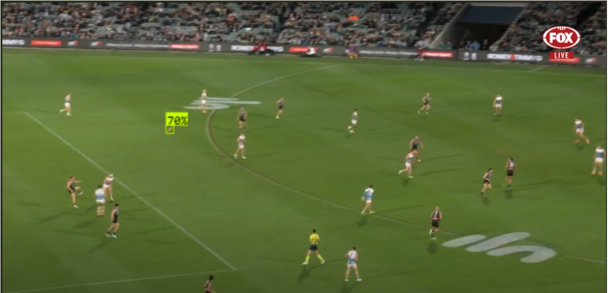
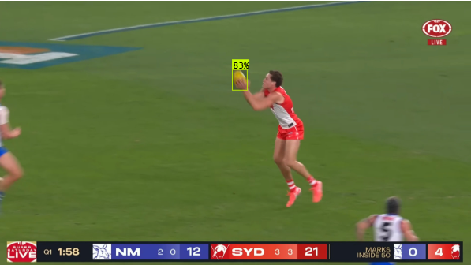
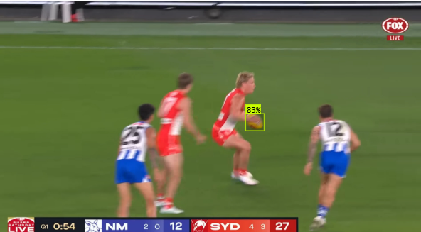

# AFL Ball Detection and Tracking Project

## Overview
This project focuses on detecting and tracking AFL balls in match footage. The system identifies the ball in each video frame using bounding boxes and can optionally estimate movement patterns such as speed or trajectory.

## Features
- **Ball Detection:** Accurately detects the AFL ball in varied game contexts.
- **Tracking:** Follows the ball's position throughout match sequences.
- **Bounding Boxes:** Consistently marks detected balls.
- **Custom Dataset:** Dataset built and labeled using Roboflow, sourced from annotated AFL clips.

## Model in Action ✅
[View our project on Roboflow](https://universe.roboflow.com/nfl-ball-tracking/afl-ball-tracking)

Screenshots from inference results:

  
  
  

## Test Our Public Model
Upload your own footage and see how well the model performs:

- [Test Our Model](https://universe.roboflow.com/nfl-ball-tracking/afl-ball-tracking/model/1)

## Table of Contents
1. [Overview](#overview)
    - [Features](#features)
2. [Speed Calculation](#speed-calculation-method)
3. [Dataset](#dataset)
4. [Challenges and Solutions](#challenges-and-solutions)
5. [Future Work](#future-work)
6. [Contributors](#contributors)
7. [Acknowledgements](#acknowledgements)

## Dataset
This dataset contains labeled AFL match footage frames. It was curated using Roboflow and annotated by our team.

- [View our Roboflow Dataset](https://universe.roboflow.com/nfl-ball-tracking/afl-ball-tracking/dataset/1)

## Challenges and Solutions
- **Fast Motion:** Improved with high-frame-rate footage and diverse training samples.  
- **Small Object Scale:** Managed via zoomed-in labels and image augmentation.  
- **Occlusion:** Addressed by adding occluded examples and adjusting anchor sizes.

## Future Work
- Improve robustness under occlusion  
- Add trajectory and direction prediction  
- Develop a real-time deployment system  
- Integrate live commentary overlay  

## Getting Added to Roboflow
To gain access to our dataset:
- Contact us on GitHub with "Roboflow Access Request"  
- Accept the invite to our Roboflow project  

## Contributors 
- [Kadyn Trayford](#)  
- [Flynn Whetters](#)  

## Acknowledgements
- **Ultralytics (YOLOv8)** for the object detection framework  
- **Roboflow** for labeling and dataset management tools  
- **Deakin University** for research support
