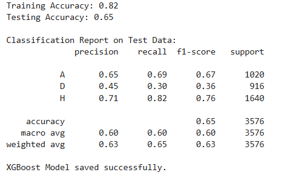
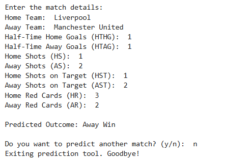

# Football Match Outcome Predictor with XGBoost

---

## **Overview**

This project predicts the outcome of football matches (Home Win, Away Win, or Draw) using **XGBoost**, a powerful machine learning algorithm. It uses historical football match data from **[Football Data UK](https://www.football-data.co.uk/)** for training and testing the model. Once trained, the model allows users to manually input live or simulated match statistics and provides predictions about the outcome.

---

### **How the Model Works**

#### **1. Data Used**
The model is trained on historical football match data, which includes match-specific statistics such as:
- Goals scored by each team (half-time and full-time).
- Shots and shots on target.
- Red cards given to players.
- Team names encoded numerically.

#### **2. Data Source**
- Data is collected from **[Football Data UK](https://www.football-data.co.uk/)**, which provides detailed historical match data for top European football leagues, such as the English Premier League, La Liga, and Bundesliga.

#### **3. Features (Factors) Used for the Model**
The following factors were used to train the model:
- **Team Encodings**:
  - `HomeTeam` (home team name encoded numerically).
  - `AwayTeam` (away team name encoded numerically).
- **Match Statistics**:
  - `HTHG` (Half-Time Home Goals).
  - `HTAG` (Half-Time Away Goals).
  - `HS` (Total Shots by the home team).
  - `AS` (Total Shots by the away team).
  - `HST` (Shots on Target by the home team).
  - `AST` (Shots on Target by the away team).
  - `HR` (Red Cards for the home team).
  - `AR` (Red Cards for the away team).
- **Target Variable**:
  - `FTR` (Full-Time Result: `H` for Home Win, `A` for Away Win, `D` for Draw).

#### **4. Model Performance**
The model achieves:
- **Training Accuracy**: 82% (high fit to training data).
- **Testing Accuracy**: 65% (reasonable generalization to unseen data).
- **Detailed Classification Report**:
  - **Precision**: Indicates how well the model identifies outcomes (Home Win, Away Win, or Draw).
  - **Recall**: Measures how many actual outcomes the model correctly identifies.
  - **F1-Score**: A balance of precision and recall.




---

## **Libraries and Dependencies**

Before running the project, ensure you have the following libraries installed. Use the commands below:

```bash
pip install pandas scikit-learn xgboost joblib numpy
```

---

## **How to Train the Model**

1. **Training Data**: Place historical match data in a structured folder (e.g., `data/english-premier-league_zip/`).
2. **Run the Training Script**: Execute the `Training.ipynb` notebook 
3. **Output**:
   - Training and testing accuracy.
   - Saved model (`xgb_classifier.model`) for future use.
4. **Training Factors**:
   - The script uses numerical encodings for teams and match statistics for prediction.

---

## **How to Use the Model**

The prediction script (`Predictor.ipynb`) allows you to make predictions by manually inputting match details. 

1. **Run the Predictor Script**:
   Execute the `Predictor.ipynb` notebook 

2. **Input Details**:
   The script will prompt you to enter the following match statistics:
   - **Home Team**: Name of the home team.
   - **Away Team**: Name of the away team.
   - **Half-Time Home Goals (HTHG)**: Goals scored by the home team at half-time.
   - **Half-Time Away Goals (HTAG)**: Goals scored by the away team at half-time.
   - **Home Shots (HS)**: Total shots attempted by the home team.
   - **Away Shots (AS)**: Total shots attempted by the away team.
   - **Home Shots on Target (HST)**: Shots on target by the home team.
   - **Away Shots on Target (AST)**: Shots on target by the away team.
   - **Home Red Cards (HR)**: Red cards for the home team.
   - **Away Red Cards (AR)**: Red cards for the away team.

3. **Output**:
   The model will predict the match outcome:
   - **H**: Home Win
   - **A**: Away Win
   - **D**: Draw.



---

## **Future Work**

### **1. Continuous Live Score Updates**
- **Enhancement**:
  - Automate live score input during matches.
  - Update match statistics dynamically to refine predictions in real time.
- **Implementation**:
  - Integrate APIs (e.g., **Football Data API** or **Live Score API**) to feed real-time data into the predictor.

---

### **2. Improved Accuracy**
- **Enhancements**:
  - Add more training data from additional leagues and seasons.
  - Include advanced features such as:
    - Team form (e.g., points earned in the last 5 matches).
    - Player-level data (e.g., key player injuries or performance).
    - Match context (e.g., league final vs. regular season).
- **Implementation**:
  - Retrain the model periodically with updated and enriched data.
  - Use hyperparameter tuning (e.g., GridSearchCV) to optimize model parameters.

---

### **3. Real-Time Predictions Dashboard**
- Build an interactive web dashboard using frameworks like **Streamlit** or **Dash**.
- Features:
  - Visualize match predictions dynamically.
  - Display real-time match data alongside predictions.

---


