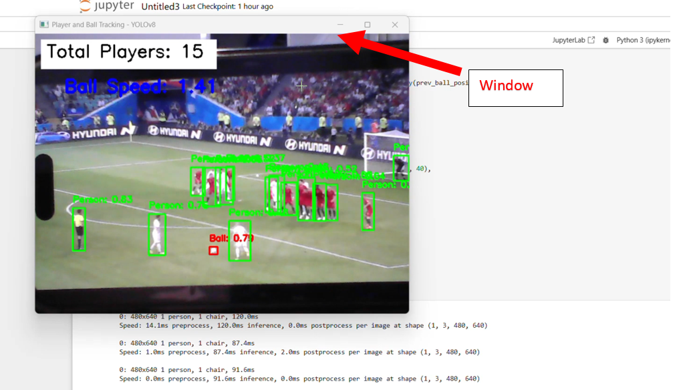
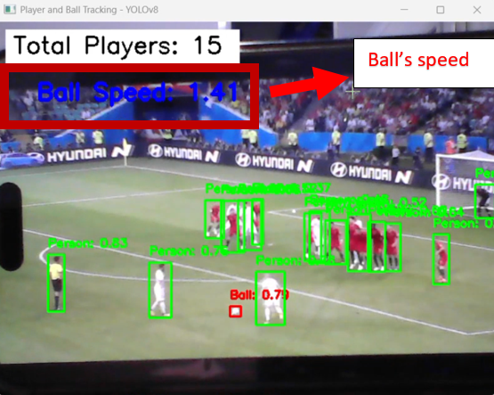

# Player and Ball Tracking with YOLOv8

### Overview

This project implements a real-time player and ball tracking system using the YOLOv8 model. The system is capable of detecting and tracking players and the ball in a live video feed from a cam. It also estimates the speed of the ball based on movement between frames. This solution can be particularly useful for analyzing sports footage, such as football matches.

### Pre-installation of Dependencies

To run the player and ball tracking code, make sure you have the following libraries installed:

```bash
pip install opencv-python-headless
pip install torch
pip install ultralytics
pip install numpy
```

Ensure that you have the YOLOv8 model (`yolov8n.pt`) downloaded and available in the working directory.

This code requires Python 3.9 or 3.10 for compatibility with the YOLOv8 model and other dependencies.

### Step-by-Step Guide

#### 1. Install Python

Make sure you have Python 3.9 or 3.10 installed on your system. You can download it from [python.org](https://www.python.org/downloads/).

#### 2. Set Up a Virtual Environment (Optional but Recommended)

It's a good practice to use a virtual environment to manage dependencies:

```bash
python -m venv player_tracking_env
```

Activate the virtual environment:
- **Windows:**
  ```bash
  player_tracking_env\Scripts\activate
  ```
- **macOS/Linux:**
  ```bash
  source player_tracking_env/bin/activate
  ```

#### 3. Install Required Libraries

Install the required Python libraries by running the following commands:

```bash
pip install opencv-python-headless
pip install torch
pip install ultralytics
pip install numpy
```

- `opencv-python-headless`: Used for image and video processing without GUI support.
- `torch`: PyTorch library, required for running YOLO models.
- `ultralytics`: Contains the YOLOv8 implementation.
- `numpy`: Used for numerical operations, including distance calculations.

#### 4. Download the YOLOv8 Model

Download the YOLOv8 model (`yolov8n.pt`) from the official [Ultralytics GitHub repository](https://github.com/ultralytics/yolov5/releases). Make sure to place this file in the same directory as your code.

#### 5. Run the Code

Use the following script to start tracking players and the ball:

```python
import cv2
import torch
from ultralytics import YOLO
import time
import numpy as np

# Load YOLOv8 model
model = YOLO('yolov8n.pt')  # Make sure to have the pretrained yolov8n.pt file

# Initialize video capture for live video (default camera)
capture = cv2.VideoCapture(0)

# Variables for tracking
prev_ball_position = None  # Previous position of the ball
ball_speed_threshold = 45  # Speed threshold for ball tracking

if not capture.isOpened():
    print("Error: Could not open the video camera.")
    exit()

while True:
    # Capture frame-by-frame
    ret, frame = capture.read()
    if not ret:
        print("Error: Failed to capture frame from camera.")
        break

    # Run YOLOv8 model on frame
    results = model(frame)
    detections = results[0].boxes.data.cpu().numpy() if results else []

    # Current positions
    current_player_positions = []
    current_ball_position = None

    for detection in detections:
        x1, y1, x2, y2, score, class_id = detection[:6]
        if class_id == 0:  # Assuming class 0 is person
            label = f"Person: {score:.2f}"
            cv2.rectangle(frame, (int(x1), int(y1)), (int(x2), int(y2)), (0, 255, 0), 2)
            cv2.putText(frame, label, (int(x1), int(y1) - 10), cv2.FONT_HERSHEY_SIMPLEX, 0.5, (0, 255, 0), 2)
            current_player_positions.append(((int(x1) + int(x2)) // 2, (int(y1) + int(y2)) // 2))  # Center of the box
        elif class_id == 32:  # Assuming class 32 is ball
            label = f"Ball: {score:.2f}"
            cv2.rectangle(frame, (int(x1), int(y1)), (int(x2), int(y2)), (0, 0, 255), 2)
            cv2.putText(frame, label, (int(x1), int(y1) - 10), cv2.FONT_HERSHEY_SIMPLEX, 0.5, (0, 0, 255), 2)
            current_ball_position = ((int(x1) + int(x2)) // 2, (int(y1) + int(y2)) // 2)  # Center of the box

    # Calculate ball speed if previous position exists
    if prev_ball_position is not None and current_ball_position is not None:
        ball_speed = np.linalg.norm(np.array(current_ball_position) - np.array(prev_ball_position))
        cv2.putText(frame, f'Ball Speed: {ball_speed:.2f}', (50, 100),
                    cv2.FONT_HERSHEY_SIMPLEX, 1, (255, 0, 0), 3)

    # Update previous ball position for the next frame
    prev_ball_position = current_ball_position

    # Display the number of players detected on the frame
    cv2.rectangle(frame, (10, 10), (310, 60), (255, 255, 255), -1)
    cv2.putText(frame, f'Total Players: {len(current_player_positions)}', (20, 40),
                cv2.FONT_HERSHEY_SIMPLEX, 1, (0, 0, 0), 2)

    # Display the frame
    cv2.imshow('Player and Ball Tracking - YOLOv8', frame)

    # Break the loop when 'q' is pressed
    if cv2.waitKey(1) & 0xFF == ord('q'):
        break

# Release the capture and close all windows
capture.release()
cv2.destroyAllWindows()
```

#### 6. Viewing the Results

- Once you run the script, a window will open displaying the live video feed.
  
- The code will draw bounding boxes around detected players (in green) and the ball (in red).
  
- It will also estimate and display the speed of the ball.
  
- Press the 'q' key to exit the video feed.

### Troubleshooting

- **Video Window Not Opening**: Ensure that your OpenCV installation includes GUI support (try using `opencv-python` instead of `opencv-python-headless`).
- **YOLO Model Not Found**: Make sure `yolov8n.pt` is in the same directory as your script.
- **Camera Not Detected**: Make sure your webcam is properly connected and accessible.

### Additional Notes

- This project uses the YOLOv8n model, which is the nano version of YOLOv8. You can replace it with other versions (e.g., `yolov8s.pt`, `yolov8m.pt`) depending on your system's computational power.
- If you experience frame lagging, consider resizing the input frames or using a more lightweight model.

Feel free to reach out if you need further assistance or encounter any issues while setting up the project.


This overview was made by Hishoban K.